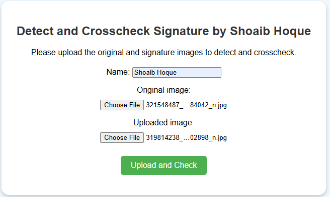
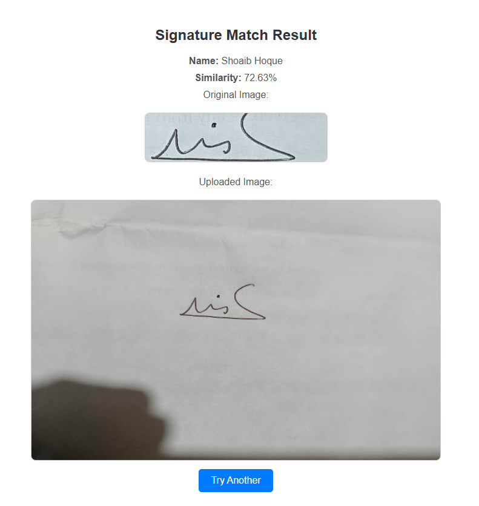
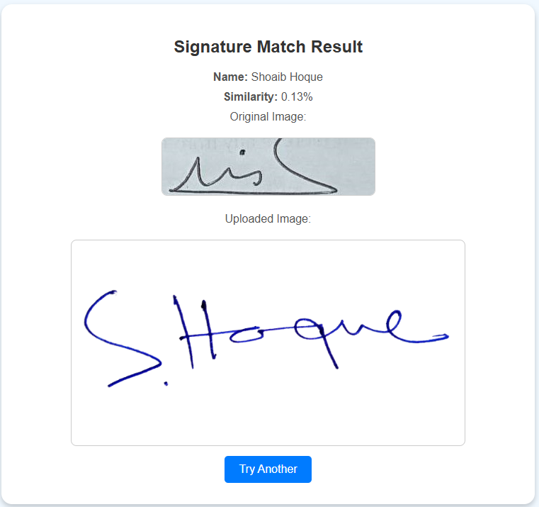

# Detect and Crosscheck Signature by Shoaib Hoque

A Django-based web application for uploading and comparing signatures. This application allows users to upload an original signature image and a new image to detect similarities. It uses OpenCV and SSIM (Structural Similarity Index) for image preprocessing and comparison.

## Features
- Upload an original and a test signature image.
- Preprocess images to enhance accuracy (denoising, resizing, thresholding).
- Detect similarities between the two images using SSIM.
- Display the similarity percentage and both images for review.
- User-friendly interface with modern design.
- Easily extendable for additional image processing features.

## Tech Stack
- **Backend:** Python, Django
- **Frontend:** HTML, CSS
- **Image Processing:** OpenCV, scikit-image (SSIM)
- **Database:** SQLite (default Django DB)

## Screenshots
### Upload Page


### Result Page with Similar Signature


### Result Page with Different Signature


## Installation
Follow these steps to run the project locally:

### Prerequisites
- Python 3.10 or later installed on your machine.
- pip (Python package manager) installed.

### Step 1: Clone the Repository
```bash
git clone https://github.com/ShoaibHoque/signature_match.git
cd signature_match
```
### Step 2: Create and activate a Virtual Environment
```bash
pip install virtualenv
virtualenv -p python3.10 signature_env
.\signature_env\Scripts\activate
```
### Step 3: Install Dependencies
```bash
pip install -r requirements.txt
```
### Step 4: Apply Migrations
```bash
cd signature_project
python manage.py makemigrations
python manage.py migrate
```
### Step 5: Run the Development Server
```bash
python manage.py runserver
```
Visit http://127.0.0.1:8000/signature/upload/ in your browser.

## Usage
1. Upload an original signature image and a test signature image.
2. Click "Upload and Check."
3. View the similarity percentage and both images on the result page.
4. Click "Try Another" to upload new images.

## Contact
For any questions or feedback, please contact:

- **Name:** Shoaib Hoque
- **Email:** shoaibhoque@gmail.com
- **LinkedIn:** [Shoaib Hoque](https://www.linkedin.com/in/shoaib-hoque-2bb20314b/)
- **GitHub:** [ShoaibHoque](https://github.com/ShoaibHoque)

